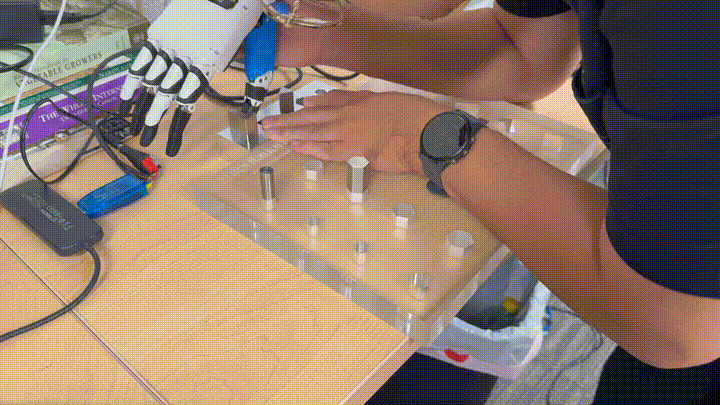
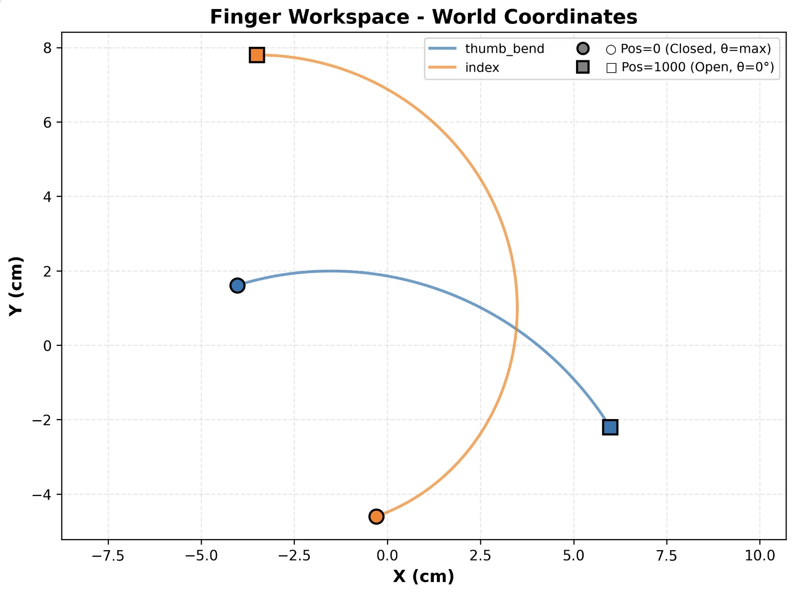

# Overview

This repository provides both the **control stack** and the **quantitative experimental benchmarks** for the Inspire RH56DFX dexterous hand. 
It includes calibrated force mapping, dynamic step-response characterization, high-speed force-limiting analysis, and command-to-motion latency, establishing a reproducible baseline for contact-rich manipulation research while supporting ROS 2 integration for deployment.

## 🎥 Grasp Demos

> Click a preview to open the full MP4.
### Force control demo
| Preview | Video |
|:--|:--|
| <a href="https://github.com/correlllab/rh56_controller/raw/main/resource/video/force_control.mp4"></a> | [▶︎ MP4](https://github.com/correlllab/rh56_controller/raw/main/resource/video/force_control.mp4) |

### Precision Grasp
| Preview | Video |
|:--|:--|
| <a href="https://github.com/correlllab/rh56_controller/raw/main/resource/video/nut1.mp4"></a> | [▶︎ MP4](https://github.com/correlllab/rh56_controller/raw/main/resource/video/nut1.mp4) |
| <a href="https://github.com/correlllab/rh56_controller/raw/main/resource/video/nut2.mp4"></a> | [▶︎ MP4](https://github.com/correlllab/rh56_controller/raw/main/resource/video/nut2.mp4) |
| <a href="https://github.com/correlllab/rh56_controller/raw/main/resource/video/cube.mp4"></a> | [▶︎ MP4](https://github.com/correlllab/rh56_controller/raw/main/resource/video/cube.mp4) |

### Comparison: Long Object (2-finger pinch vs 4-finger power)
| Preview | Video |
|:--|:--|
| <a href="https://github.com/correlllab/rh56_controller/raw/main/resource/video/2finger_pinch_long_obj.mp4"></a> | [▶︎ MP4](https://github.com/correlllab/rh56_controller/raw/main/resource/video/2finger_pinch_long_obj.mp4) |
| <a href="https://github.com/correlllab/rh56_controller/raw/main/resource/video/4finger_grab_long_obj.mp4"></a> | [▶︎ MP4](https://github.com/correlllab/rh56_controller/raw/main/resource/video/4finger_grab_long_obj.mp4) |
---

## Installation (uv)

This repository uses [uv](https://docs.astral.sh/uv/) as the package manager.  `uv` automatically manages a virtual environment and resolves the vendored `mink` dependency (differential IK library) from the local `mink/` subdirectory.

```bash
# Install uv (one-time, if not already installed)
curl -LsSf https://astral.sh/uv/install.sh | sh

# Clone and set up the environment
git clone https://github.com/correlllab/rh56_controller.git
cd rh56_controller
uv sync          # creates .venv and installs all dependencies

# Run any module through the managed environment
uv run python -m rh56_controller.grasp_viz
uv run python -m rh56_controller.grasp_viz --robot
```

`uv sync` installs:
- `numpy`, `scipy`, `matplotlib` — numerical + plotting stack
- `mujoco >= 3.3.6` — physics simulation and passive viewers
- `mink` (from `./mink/`) — differential IK for arm + hand planning
- `pyserial` — real-hand USB/serial communication

To run without the mink planner (e.g., hardware-only use without simulation):
```bash
uv run python -m rh56_controller.grasp_viz --no-mink
```

---

## Force Mapping to Newtons

> This repository currently exposes finger forces in **raw 0–1000 units**.  
> External experiments show a **linear** relationship between the raw reading `r` and force in Newtons `F` for each finger:
>
> $$
> F_i\,[\mathrm{N}] = a_i \cdot r_i + b_i
> $$
>
> Where \(i \in \{\text{pinky, ring, middle, index, thumb\_bend, thumb\_rotate}\}\).

**Status.** We will publish the initial coefficients for **thumb_bend**, **index**, and **middle** here, together with the validation range and R² (others TBD).

### Force Mapping — Initial Coefficients (published on 2025‑11‑04)

We fitted a linear model for **index**, **middle**, and **thumb_bend** using ground‑truth measurements from a force meter:

$$
F_i\,[\mathrm{N}] = a_i\, r_i + b_i
$$

| Finger | a (N/unit) | b (N) | R² | Valid raw range | N |
|:--|--:|--:|--:|:--|--:|
| index | 0.007478 | -0.414 | 0.987 | 102–980 | 10 |
| middle | 0.006452 | 0.018 | 0.986 | 112–990 | 10 |
| thumb bend | 0.012547 | 0.384 | 0.993 | 91–1000 | 9 |

**Usage (example):**
```python
# raw -> Newtons
COEFFS = {
    "index":       ( 0.007478, -0.414 ),
    "middle":      ( 0.006452, 0.018 ),
    "thumb_bend":  ( 0.012547, 0.384 ),
}
def raw_to_newtons(raw, finger="index"):
    a, b = COEFFS[finger]
    return a * float(raw) + b
```

> **Notes.**
> * Our hand is damaged so the results might not be accurate.
> * The fits are valid within the listed raw ranges; outside this interval you will be extrapolating.
> * Measured maximal forces at `r=1000` are approximately: index ≈ 7.06 N, middle ≈ 6.47 N, thumb_bend ≈ 12.93 N.

*Note on Poll Rate*

Currently only the `q, tau` are read from the hands and published to `/hands/state`. This is because the hands are on the same serial device with different slave IDs. While I am able to send separate, async commands to the hands for some reason, async read operations overlap and cause serial bus errors. So, we read and build the `/hands/state` with these four sequential calls:
```
right_angles = self.righthand.angle_read()
right_forces = self.righthand.force_act()
left_angles = self.lefthand.angle_read()
left_forces = self.lefthand.force_act()
```

Each read operation takes 0.006s, totalling 0.024s for four reads. After ROS overhead, the 41.67 Hz poll rate is closer to 40.2 Hz. This should be fast enough but I welcome any efforts to potentially double this by asynchronously reading.

---
## X‑mode: Force‑Reactive Pinch for Peg‑in‑Hole

**What it does.**  
X‑mode is a lightweight, event‑driven controller for the RH56 hand that
- **auto‑closes** on contact to pick the part, and
- **auto‑opens** after a **short horizontal verification** confirms that the peg is constrained by the hole (index finger spike),
enabling fully automated pick–insert–release cycles.

**Signals & units.**  
All force/pressure readings are **raw, unitless counts** (e.g., 0–1000). Thresholds below are specified in these raw units.

### Event logic

1. **Pre‑grasp & limits.** Move to a precision‑pinch pre‑grasp and set per‑finger force limits (index, thumb).
2. **Auto‑close on contact (thumb).** Monitor the thumb channel; when a **positive jump** ΔF_th ≥ `CONTACT_SPIKE` occurs, **close** to grasp.  
   *Timeout:* if **no contact** is detected for `TIMEOUT` (≈20 s), **open** and reset to `WAIT`.
3. **Stabilize grasp (index).** After closing, monitor the **index** moving‑average; once it exceeds `LOAD_ARM`, the grasp is considered established.
4. **Horizontal verification.** If the **index** force reading shows a **spike** ΔF_idx ≥ `LATERAL_SPIKE`, interpret this as **peg constrained by the hole** (i.e., insertion achieved).
5. **Auto‑open to release.** On successful horizontal verification, **open** (with an error‑clear + second open for robustness) and return to `WAIT`.  
   *Timeout:* if no lateral spike is observed for `TIMEOUT`, **open** and reset.

### Default parameters (tune per task; all in raw, unitless counts)

- `FORCE_LIMIT` (per finger): **~800**  
- `CONTACT_SPIKE` (thumb Δ): **+75**  
- `LOAD_ARM` (index moving‑avg): **≥ 500**  
- `LATERAL_SPIKE` (index Δ during sweep): **+75**  
- Moving‑average window: **~0.5 s**  
- `TIMEOUT`: **~20 s**

## 📊 2025‑11‑04 — Calibration & Benchmarks

This section aggregates the results from today's experiments and can be moved into a new `experiments/2025-11-04/` folder in the repo if desired. The raw data files are listed at the end of this section.

### Step‑Response Characterization (position control)

**Setup.** Each finger was commanded a unit step from its baseline to `target_angle = 500` (raw units) at several speeds. We report rise/settling times, overshoot and steady‑state error as computed by the post‑processing scripts.

**Takeaways.**
- At `speed=1000`, rise times are ~0.18–0.30 s and settling times ~0.27–0.43 s for index/middle/thumb joints with minimal overshoot (where observed).  
- Thumb‑rotate often undershoots the target (negative steady‑state error); consider offset compensation in the driver.

---

### Force‑Limit Overshoot vs. Speed (force stop)

The test applied a fixed force limit (raw units) and measured the peak force at different speeds on **middle (finger=2)**:

| speed | force_limit | force_peak | overshoot | peak_limit_pct |
| --: | --: | --: | --: | --: |
| 1000.000 | 500.000 | 1556.000 | 1056.000 | 211.200 |
| 500.000 | 500.000 | 1246.000 | 746.000 | 149.200 |
| 250.000 | 500.000 | 1073.000 | 573.000 | 114.600 |
| 100.000 | 500.000 | 996.000 | 496.000 | 99.200 |
| 50.000 | 500.000 | 825.000 | 325.000 | 65.000 |
| 25.000 | 500.000 | 524.000 | 24.000 | 4.800 |
| 10.000 | 500.000 | 478.000 | -22.000 | -4.400 |

**Observation.** Overshoot is strongly speed‑dependent. For precision grasps, consider lowering `speed` during the final approach and using a two‑stage closing policy.

### Attempted Alternatives for High-Speed Force Limiting

Several approaches were tested to mitigate the overshoot observed when using the vendor-provided `force_limit` register at high motor speeds. 
Because the internal register does not reliably stop motion in time when `speed ≥ 25`, we attempted to implement custom software-level safeguards:

1. **Real-time force monitoring:** continuously reading the finger’s force sensor and sending an immediate new target angle to halt motion when the threshold was reached.
2. **Dynamic angle stepping:** issuing small incremental angle commands (small step size) to effectively lower motion speed while retaining manual force supervision.
3. **Hybrid scheme:** combining 1 and 2 to emulate a closed-loop stop.

However, comparative tests against the native register control showed **no measurable improvement** in either peak force or overshoot timing.  
This suggests that the observed overshoot originates in the **firmware-side latency** of command execution rather than host-side timing, and cannot be fully compensated without direct low-level access to the actuator’s embedded controller.

> **Conclusion:** for speeds above 25, the hardware register remains the limiting factor; software-side interception offers no significant benefit under the current communication interface.

### Discussion and Future Directions

Empirically, the hardware-level `force_limit` register becomes ineffective at **speeds above ≈25**, where the actuator continues to move significantly past the intended stop threshold.  
The lack of responsiveness suggests that the limit enforcement occurs only after a buffered command cycle, rather than in real-time on the motor controller.

A possible next step is to explore a **predictive host-side cutoff**, in which the system:
1. Continuously samples the real-time force readings;
2. Estimates the short-term rate of force increase (force growth trend); and
3. Issues an early stop command based on the **measured command–actuation latency** (≈60–70 ms).

This would allow the software to preemptively compensate for communication and processing delays.  
However, this concept has **not yet been experimentally validated**, and remains a candidate for future investigation once low-latency force streaming and synchronization are implemented.

---

### Command‑to‑Motion Latency
#### Trial Log (raw runs)

| trial | t_cmd | t_move | latency_s | init_at_cmd | cmd_angle |
| --: | --: | --: | --: | --: | --: |
| 1 | 220123.942812 | 220123.993149 | 0.050337 | 1000 | 700 |
| 2 | 220124.126521 | 220124.170575 | 0.044054 | 995 | 700 |
| 3 | 220124.301840 | 220124.370165 | 0.068324 | 991 | 700 |
| 4 | 220124.527222 | 220124.597639 | 0.070417 | 990 | 700 |
| 5 | 220124.743827 | 220124.812808 | 0.068980 | 993 | 700 |
| 6 | 220124.962745 | 220125.031467 | 0.068721 | 994 | 700 |
| 7 | 220125.182071 | 220125.251125 | 0.069053 | 993 | 700 |
| 8 | 220125.405745 | 220125.469990 | 0.062445 | 992 | 700 |
| 9 | 220125.626845 | 220125.689260 | 0.062416 | 994 | 700 |
| 10 | 220125.846464 | 220125.910199 | 0.063735 | 991 | 700 |

We measured latency from the **command publish** timestamp to the first detected **motion**:

- **p50**: 0.066 s
- **p90**: 0.069 s
- **p95**: 0.070 s
- **p99**: 0.070 s

**Harness parameters (representative):** `baseline≈1000`, `cmd_angle≈700`, `|Δ|≈300`, `speed≈1000`, `movement_eps≈10`.

---

### Reproducibility — Data files

Commit these into e.g. `resource/experiments/2025-11-04/`:

- `force mapping.xlsx` (Index/Mid/Thumb_bend sheets; columns: “Hand reading”, “force meter reading / N”).  
- `summary_index.csv`, `summary_mid.csv`, `summary_thumb_bend.csv`, `summary_thumb_rotate.csv` (step‑response summaries).  
- `force_stop_summary.csv` (force‑limit overshoot).  
- `latency_log.csv`, `latency_summary.json` (latency micro‑benchmark).

---


## Grasp Experiments — Protocol & Notes on Success Rates

**Protocol (two-finger baseline).**  
To evaluate grasp behavior without perception or planning, we fix the **thumb rotation** and set the **thumb bend** to a contact-seeking angle, lightly “preloading” the object. We then close the **index** (two-finger pinch). For larger or elongated objects we optionally add more fingers (thumb–index–middle / thumb–index–middle–ring).

**What this measures (and what it doesn’t).**  
- The experiment probes **local contact mechanics** (pinch vs. power grasp) under a fixed-pose assumption.  
- The **absolute success rate** is **not** a reliable metric for the grasp policy itself, because performance depends mainly on **pre-contact alignment**—that is, the relative pose between the hand, object, and table.  
- When pre-alignment is accurate, small items (e.g., nuts) can be grasped almost perfectly; when alignment drifts, failures increase sharply for small parts but are less critical for larger objects.

**Interpretation.**  
- The current rule-based closing logic performs consistently once contact is properly established.  
- Experiment outcomes therefore reflect the **precision of object presentation and hand pre-pose**, not the **control policy**.  
- In future closed-loop systems (with visual or force feedback), these trials will serve as baseline open-loop performance data.

**Recommendations.**  
- Report success rate alongside **placement error** (e.g., translational / angular deviation) rather than as an isolated figure.  
- Use a **two-stage close** (high-speed → low-speed near contact) to mitigate over-sensitivity in small objects.  
- For long or heavy objects, extend to **tripod or power** grasps once stable pinch contact is detected.  

> **Summary:** In these open-loop tests, grasp outcome is governed primarily by **pose accuracy** rather than control strategy. Improving perception and pre-grasp alignment will yield the largest real-world gains.


## Grasp Overview

The **Grasp** module provides a structured framework for evaluating and demonstrating various grasping strategies with the Inspire RH56 dexterous hand.  
Its current implementation focuses on **simple, rule-based heuristics** that allow the hand to adapt its grasp configuration based on object geometry without external perception or planning.

### Design Philosophy

Rather than using vision or high-level planning, this module relies on **measurable object dimensions**—primarily width and length—to parameterize the grasp.  
By keeping the thumb rotation fixed and varying only the **thumb bend angle** and **number of active fingers**, the controller achieves a range of grasp types from precision to power grasps with minimal complexity.

### Grasp Logic

1. **Thumb Configuration (Width-Based):**  
   - The object width determines the thumb bend angle (`thumb_bend`).  
   - Two different configurations are used now for different width object.  
   - This allows the thumb to form a stable initial pinch against the index or middle finger.

2. **Finger Selection (Length-Based):**  
   - The object length determines how many fingers are involved in the grasp.  
   - Short objects trigger a two-finger (thumb–index) pinch.  
   - Medium objects use a three-finger (thumb–index–middle) tripod grasp.  
   - Long or wide objects engage four fingers (thumb-index–middle–ring) for a full power grasp.
   - Pinky isn't really useful due to its length

3. **Force Regulation:**  
   - Each finger closes until its force reading reaches a target threshold, converted to Newtons using the linear *force mapping* calibration.  
   - This enables consistent contact pressure across objects of different stiffness and size.


### Current Capabilities

- Successfully grasps small metallic nuts, medium-sized items (e.g., Rubik’s cubes), and large objects up to 10 cm wide.  
- Demonstrates both **precision** and **power** grasp behaviors using the same heuristic policy.  
- Compatible with both stand-alone scripts and the ROS 2 driver through topic-level command injection.

### Future Directions

- Integrate visual sensing for dynamic object dimension estimation.  
- Extend the heuristics into a learning-based grasp selection policy.  
- Quantify grasp stability through external load and slippage tests.

---

> This module aims to balance **simplicity, reproducibility, and real-world performance**, serving as a baseline for more advanced manipulation strategies.


# RH56 Controller (ROS 2)

This package provides a ROS 2 driver for the Inspire RH56DFX robotic hand, which wraps the serial interface with a Python API. Force-control (in Newtons) is WIP. States publish at ~40 Hz.


### Building
1.  Clone this repository into your ROS 2 workspace's `src` directory.
2.  Navigate to the root of your workspace.
3.  Build the package using `colcon`:
    ```bash
    colcon build --packages-select rh56_controller
    ```
4.  Source the workspace's `setup.bash` file:
    ```bash
    source install/setup.bash
    ```

## Usage

*Temporary Usage*: By default, the `inspire_hand.service` connects to the hands' serial bus and publishes/subscribes to the `inspire/state` and `inspire/cmd` topics. Stop this service with: 
```bash 
sudo systemctl stop inspire_hand.service 
``` 

---

To run the driver node, use the provided launch file. You can specify the serial port, which is `/dev/ttyUSB0` by default if not specified.

```bash
ros2 launch rh56_controller rh56_controller.launch.py serial_port:=/dev/ttyUSB0
```

If for whatever reason `pyserial` is denied access to the hands USB device, run:
```bash
sudo chmod 666 /dev/ttyUSB0
```
This is a transient issue and has not cropped up for me after initial testing.


## ROS API

### MotorState msg
There are a few differences between these topics and the old `/inspire/state` message.

The new message, in `custom_ros_messages/msg/MotorState`, looks like
```bash
int32 mode
float64 q
float64 dq
float64 ddq
float64 tau
float64 tau_lim
float64 current
float64 temperature
float64 q_raw
float64 dq_raw
float64 tau_raw
float64 tau_lim_raw
```

Where `q` represents the motor position, from 0 (closed) to `pi` (extended). `q_raw` keeps it in the arbitrary 0-1000 units. Currently, `tau, tau_lim, tau_raw, tau_lim_raw` are all in the same 0-1000 units because we do not have reliable force calibration. This is because the Inspire conversion simply takes the raw unit, normalizes by 1000, and divides by gravitational acceleration (9.8 m/s^2). This would mean that the each actuator produces a maximum of **1 N** of force, which is meaningless  since 1) we expect a Nm measurement for motor torque, 2) the fingers have variable lengths and thus different ranges of contact forces, and 3) such a limit does not align with the provided specs, which lists grip forces exceeding >6 N.

### Published Topics

*   **`/hands/state`** (`custom_ros_messages/msg/MotorStates`)
    *   A not-quite-mirror of the original `inspire/state` topic. Publishes the current angle of each finger joint in radians, not the 0-1000 range, in a 12-element array (`[right[6] + left[6]]`). Subject to change if this is annoying.

### Subscribed Topics

*   **`/hands/cmd`** (`custom_ros_messages/msg/MotorCmds`)
    *   A not-quite-mirror of the original `inspire/cmd` topic. Subscribes to the 12-element array of commanded angles (`[right[6] + left[6]]`) for each finger joint in radians, not the 0-1000 range. Subject to change if this is annoying.

### Services
*   **`/hands/set_angles`** (`custom_ros_messages/srv/SetHandAngles`)
    *   Input: 6-element float array, hand specification ('left', 'right', 'both')
    * This command opens both hands.
    * ```bash
         ros2 service call /hands/set_angles custom_ros_messages/srv/SetHandAngles "{{angles: [1000, 1000, 1000, 1000, 1000, 1000], hand: 'both'}}"
*   **`/hands/calibrate_force_sensors`** (`std_srvs/srv/Trigger`)
    *   Initiates the hardware's force sensor calibration routine. This process takes approximately 15 seconds.
*   **`/hands/save_parameters`** (`std_srvs/srv/Trigger`)
    *   Saves the current configuration to the hand's non-volatile memory.
*   **TODO: `/hands/adaptive_force_control`** (`rh56_controller/srv/AdaptiveForce`)
    *   Executes the advanced adaptive force control routine. **DOES NOT WORK YET**
* Preliminary feature: named gestures `{name: String: angles: List[Int]}` in the [`rh56_driver.py:self._gesture_library`](https://github.com/correlllab/rh56_controller/blob/dcda3061751199523323d6b24221c99eade7b0a5/rh56_controller/rh56_driver.py#L78) class dictionary will autopopulate `/hands/<gesture>`, `/hands/left/<gesture>`, and `/hands/right/<gesture>` services. Run `ros2 service list | grep '^/hands/'` to see the full list of generated services. These are generic `Trigger` services and can be run with: 
    * ```bash
        ros2 service call /hands/<gesture> std_srvs/srv/Trigger
        ros2 service call /hands/left/<gesture> std_srvs/srv/Trigger
        ros2 service call /hands/right/<gesture> std_srvs/srv/Trigger
    * ```bash
        ros2 service list | grep '^/hands/'
        /hands/close
        /hands/left/close
        /hands/left/open
        /hands/left/pinch
        /hands/left/point
        /hands/open
        /hands/pinch
        /hands/point
        /hands/right/close
        /hands/right/open
        /hands/right/pinch
        /hands/right/point
## Examples

### Close the Index Finger
The joints on the hand are ordered as such: `[pinky, ring, middle, index, thumb_bend (pitch), thumb_rotate (yaw)]`. This command closes the index finger while opening the other joints.

```bash
 ros2 service call /hands/set_angles custom_ros_messages/srv/SetHandAngles "{{angles: [1000, 1000, 1000, 0, 1000, 1000], hand: 'both'}}"
```

### Calibrate the Sensors

```bash
ros2 service call /calibrate_force_sensors std_srvs/srv/Trigger
```

<details>
<summary><b>Legacy Python Script Documentation (Pre-ROS)</b></summary>

## RH56 Advanced Hand Controller (Legacy)
## 1. Project Overview

This project contains a Python script (`controller.py`) for controlling the RH56 dexterous hand via a serial port. The script encapsulates the low-level communication protocol and provides a high-level `RH56Hand` Python class, making it easier for developers to implement complex control logic.

Currently, the project features a **Adaptive Force Control** function that can adjust force thresholds while dynamically changing finger positions to achieve a preset contact force.

## 2. Core Features

- **Basic Control**:
  - Set/read the angle for all six degrees of freedom (five fingers + thumb rotation).
  - Set/read the movement speed for each finger.
  - Set/read the force control threshold for each finger (unit: grams).
- **Sensor Reading**:
  - Real-time reading of the pressure sensor for each finger (unit: grams).
- **Force Sensor Calibration**:
  - Provides an interactive calibration routine to calibrate the force sensors before precise control operations.
- **Advanced Control Logic**:
  - **Adaptive Force Control (`adaptive_force_control`)**: This is an advanced control mode with the following characteristics:
    1. **Position-Force Coordinated Control**: Can simultaneously move fingers to a target **angle** and have them reach a target **contact force**.
    2. **Step-wise Adjustment**: Gradually moves fingers to the target position instead of all at once, making the control process smoother and more stable.
    3. **Intelligent Force Adjustment**: During movement, it dynamically adjusts the force control threshold based on the difference between the current force reading and the original target.

## 3. Setup and Installation

### Hardware
- RH56 Dexterous Hand
- USB-to-Serial adapter to connect the hand to the computer

### Software
- Python 3
- `pyserial` library
- `numpy` library


## 4. Configuration

Before running the script, you need to modify two key parameters at the **bottom** of the `controller.py` file, inside the `if __name__ == "__main__":` block, according to your setup:

1.  **Serial Port (`port`)**:
    -   Find the line `hand = RH56Hand(...)`.
    -   Change the `port` parameter to the actual serial port recognized by your computer.
        -   **Windows**: e.g., `COM3`, `COM4`
        -   **macOS/Linux**: e.g., `/dev/tty.usbserial-xxxx` or `/dev/ttyUSB0`

2.  **Hand ID (`hand_id`)**:
    -   In the same line, modify the `hand_id` parameter.
        -   **1**: Right Hand
        -   **2**: Left Hand

**Example:**
```python
if __name__ == "__main__":
    # Modify the parameters here based on your hardware connection
    hand = RH56Hand(port="/dev/tty.usbserial-1130", hand_id=1) 
    ...
```

## 5. Usage

The script can be run directly to start the pre-configured **Adaptive Force Control** demonstration.

### Steps to Run
1.  **Connect Hardware**: Ensure the dexterous hand is correctly connected to the computer and powered on.
2.  **Modify Configuration**: Correctly configure the serial port and hand ID as described in the previous section.
3.  **Execute Script**: Run the following command in your terminal:
    ```bash
    python controller.py
    ```
4.  **Start Calibration (Optional)**:
    -   By default, the script first runs `demonstrate_force_calibration`.
    -   You will see the prompt `Press Enter to start calibration...`. Press Enter to begin. The calibration process takes about 15 seconds.
    -   If you do not need to calibrate, you can comment out the `demonstrate_force_calibration(...)` line in the `__main__` block.
5.  **Observe Adaptive Force Control**:
    -   After calibration, the script will automatically start the `adaptive_force_control` routine.
    -   You will see real-time output in the terminal showing each finger's **current angle**, **current force reading**, **original target force**, and the **action taken** for each iteration.
    -   The program will finish after reaching the targets or the maximum number of iterations and will print a final summary report.

## 6. Key Methods (API)


---
`force_set(thresholds: List[int])`
- **Function**: Directly sets the force control thresholds for the 6 fingers.
- **Parameters**: `thresholds` - A list of 6 integers, with each value ranging from 0-1000g.

---
`angle_set(angles: List[int])`
- **Function**: Sets the target angles for the 6 fingers.
- **Parameters**: `angles` - A list of 6 integers, with each value ranging from 0-1000.

---
`force_act() -> Optional[List[int]]`
- **Function**: Reads and returns the current force sensor readings for the 6 fingers (unit: grams).
- **Returns**: A list of 6 integers, or `None` if the read fails.

---
`angle_read() -> Optional[List[int]]`
- **Function**: Reads and returns the current angle positions for the 6 fingers.
- **Returns**: A list of 6 integers, or `None` if the read fails.

---
`adaptive_force_control(target_forces: List[int], target_angles: List[int], step_size: int = 50, max_iterations: int = 20)`
- **Function**: Executes the advanced adaptive force control routine.
- **Parameters**:
  - `target_forces`: List of target contact forces (unit: grams).
  - `target_angles`: List of target angles.
  - `step_size`: The angle step for each iteration.
  - `max_iterations`: The maximum number of iterations.
- **Returns**: A dictionary containing detailed results and history.

---
`demonstrate_force_calibration(port: str, hand_id: int)`
- **Function**: Starts an interactive force sensor calibration routine. It is recommended to run this before performing precision tasks.

## 7. Known Issues and Limitations

- **Controller Precision and Response**: The precision and response speed of the finger controllers are currently limited.
- **Force Control Overshoot**: Even at the slowest movement speeds, the force control can overshoot the preset target values by 50-100 grams.
- **High-Speed Behavior**: When moving at high speeds, the fingers tend to "ignore" the preset maximum force thresholds and move directly to their peak force.
- **Testing Status**: All features have currently only undergone light and informal testing. 

</details>
